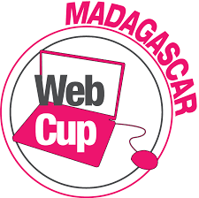
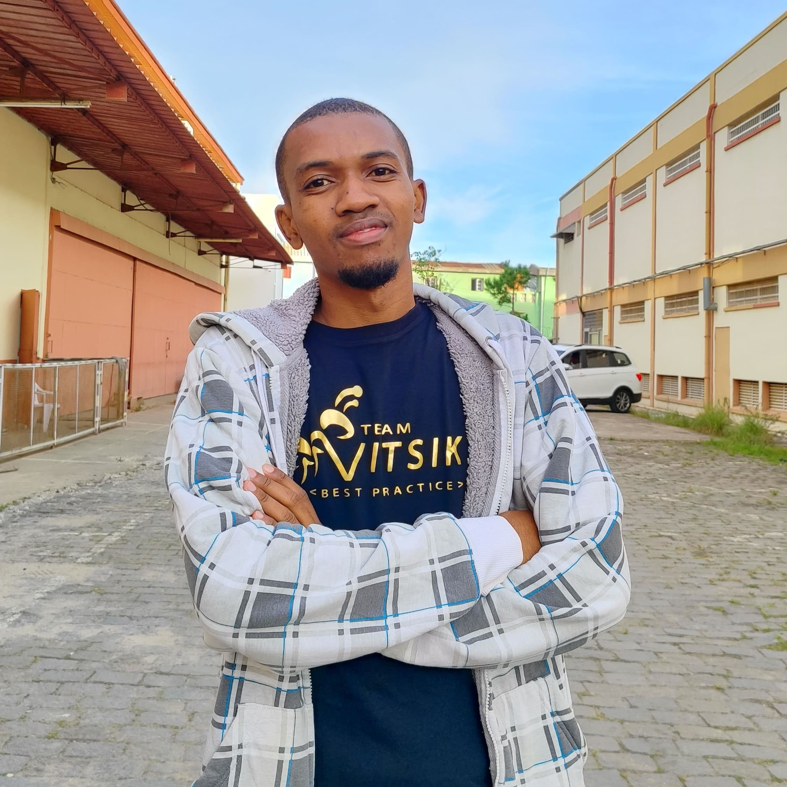
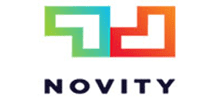
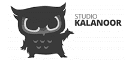

<div>
  <div align="center">
    
  </div> 
  <div align="left">  
    <h1>TEAM SUPERVOVA</h1>
    <small>Webcup 2024</small>
  </div>                              
  <p>SUPERNOVA est bien plus qu'une simple équipe, c'est une constellation d'esprits brillants venus ensemble pour illuminer le paysage numérique de la Webcup 2024. Avec une passion ardente pour l'innovation technologique et une détermination sans faille, chaque membre de SUPERNOVA apporte sa propre talent et ses compétences à notre équipe. Nous sommes un mélange dynamique de développeurs web, de designers créatifs et de modeleur 3D, unis par notre désir commun de repousser les limites de ce qui est possible sur le web.</p>                                                                                          
  <h1>WEBCUP 2024</h1>
  <div align="center">   
    
  </div> 
  <p>La Webcup 2024 est l'événement incontournable de l'année pour les passionnés du numérique, les créatifs de l'internet et les innovateurs de demain. Cette compétition palpitante réunit des équipes du monde entier pour relever des défis technologiques, repousser les limites de la créativité et créer l'avenir du web.</p> 

  ---

  <h1>A propos de notre projet : PROJECT_NAME</h1>

  <div align="center">   
    
  </div> 

  <p>Description du projet</p> 

  
  

  # Technologies

  |    |   Tech         | Description |
  |----|-------------------|---------------------------------------------------------------|
  | 🧩  | **REACT**  | Choisi pour sa popularité, sa flexibilité et sa performance. React permet de construire des interfaces utilisateur dynamiques et réactives, tout en assurant une séparation claire entre la logique métier et la présentation grâce au modèle MVP.|
  | 🔩 | **NodeJs**  | Sélectionné pour son architecture légère et sa capacité à gérer de grandes charges de travail en temps réel. Node.js offre une rapidité et une évolutivité idéales pour les applications nécessitant une communication en temps réel, tout en respectant les bonnes pratiques de codage et les directives de style Android. |
  | 📦 | **Blender** | Choisit pour sa polyvalence et sa puissance dans la modélisation et l'animation 3D. Blender permet de créer des graphismes et des animations époustouflants pour enrichir l'expérience utilisateur, même si la documentation fournie est succincte mais suffisante pour comprendre les éléments 3D du projet. |

  # Fonctionnalité
  |    |   Fonctionnalités         | Description |
  |----|-------------------|---------------------------------------------------------------|
  | 🧩  | **REACT**  | Choisi pour sa popularité, sa flexibilité et sa performance. React permet de construire des interfaces utilisateur dynamiques et réactives, tout en assurant une séparation claire entre la logique métier et la présentation grâce au modèle MVP.|
  | 🔩 | **NodeJs**  | Sélectionné pour son architecture légère et sa capacité à gérer de grandes charges de travail en temps réel. Node.js offre une rapidité et une évolutivité idéales pour les applications nécessitant une communication en temps réel, tout en respectant les bonnes pratiques de codage et les directives de style Android.   |
  | 📦 | **Blender** | Choisit pour sa polyvalence et sa puissance dans la modélisation et l'animation 3D. Blender permet de créer des graphismes et des animations époustouflants pour enrichir l'expérience utilisateur, même si la documentation fournie est succincte mais suffisante pour comprendre les éléments 3D du projet. |

  ---

  ## Configuration

  ***Prérequis***

  Assurez-vous d'avoir les dépendances suivantes installées sur votre système :

  * **yarn**: `version 1.22.22`
  * **NodeJS**: `version 20.12.1`
<br />

### :key: variables d'environnement

Pour exécuter ce projet, vous devrez ajouter les variables d'environnement suivantes à votre fichier .env

`PROJECT_NAME`


### :running: Lancement en Local

Clone le projet

```bash
  git clone "lien git du projet"
```

Accédez au répertoire du projet

```bash
  cd "repertoire du projet"
```

Installez les dépendances 

```bash
  yarn install
```

Démarrez le serveur  


```bash
  yarn run start
```


## :wave: Team
<p> 
  
  
  
  
</p> 
Une équipe de choc!

## 🙇 Un grand merci à :

<div>
    
    
    
    
    
    
    
    
    
    
    
    
    
    
    
    
    
</div>

</div>